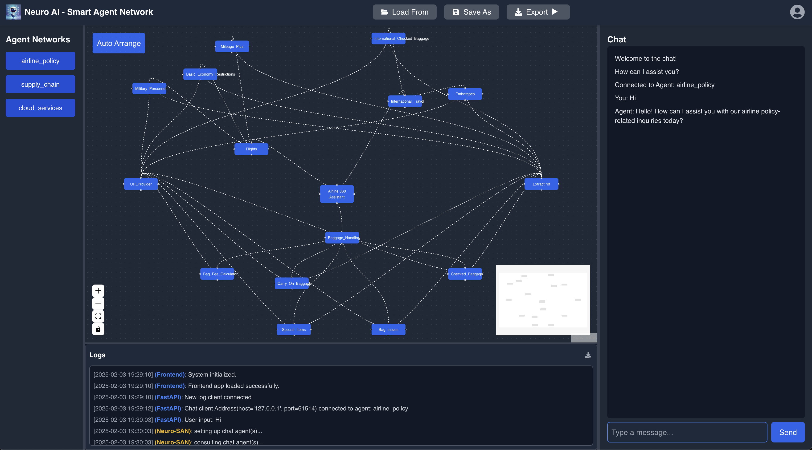

# NSFlow - Neuro-SAN Smart Agent Network

NSFlow is a framework that enables users to explore, visualize, and interact with smart agent networks using **FastAPI (backend)** and **React (frontend)**. It integrates **Neuro-SAN** for intelligent agent-based interactions.

## Neuro AI - Smart Agent Network


---
## **Installation & Running NSFlow**

NSFlow can be installed and run in **three different ways:**

### **1️⃣ Direct Run (Manually Start Frontend & Backend)**
If you prefer to start the frontend and backend separately, follow these steps:

#### **Step 1: Clone the Repository**
```bash
git clone https://github.com/your-org/nsflow.git
cd nsflow
```

#### **Step 2: Install Dependencies**
Make sure you have **Python 3.12** and **Node.js (with Yarn)** installed.

```bash
pip install uv or brew install uv
uv pip compile pyproject.toml --output requirements.txt
uv pip install -r requirements.txt
cd frontend
yarn install
```

#### **Step 3: Start the Backend**
```bash
cd .. # Back to project root
python -m nsflow.run
```

#### **Step 4: Start the Frontend**
```bash
cd frontend
yarn dev
```

Your **backend** will be available at: `http://127.0.0.1:8000`

Your **frontend** will be available at: `http://127.0.0.1:5173`

---
### **2️⃣ Run with NSFlow CLI**
To simplify execution, NSFlow provides a CLI command to start both the backend and frontend simultaneously.

#### **Step 1: Install NSFlow as a Package**
```bash
pip install nsflow
```

#### **Step 2: Run Everything with a Single Command**
```bash
nsflow run
```

This will:
- Start the **backend** (FastAPI + Neuro-SAN)
- Start the **frontend** (React)

After running, access:
- **Frontend**: `http://127.0.0.1:5173`
- **API Docs**: `http://127.0.0.1:8000/docs`

---
### **3️⃣ Run NSFlow with Docker**
You can run NSFlow inside a **Docker container**, which includes both the backend and frontend.

#### **Step 1: Build the Docker Image**
```bash
docker build -t nsflow .
```

#### **Step 2: Run the Docker Container**
```bash
docker run -p 8000:8000 -p 5173:5173 nsflow
```

Once the container is running, you can access:
- **Frontend**: `http://127.0.0.1:5173`
- **API Docs**: `http://127.0.0.1:8000/docs`

---
## **Development & Contribution**
If you want to contribute, ensure you have the necessary dependencies installed:

```bash
make install
```

To test changes, you can use:
```bash
make test
```

For building the package:
```bash
make build
```

---
## **Publishing to PyPI**
To build and publish the package:
```bash
make package
make publish
```

---
